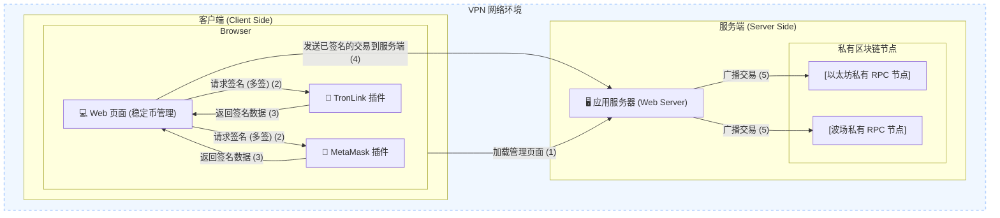
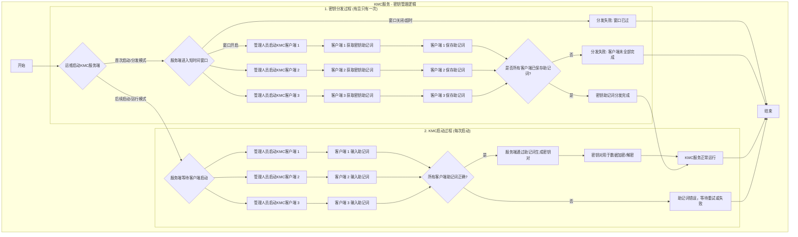
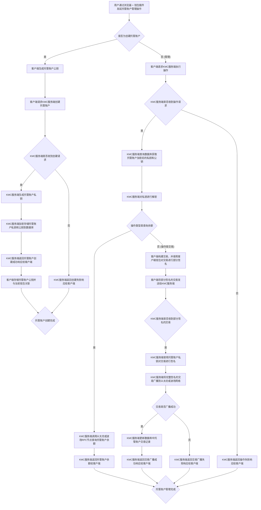

# 稳定币管理套件

稳定币管理平台包括三个定制开发组件

- 管理员多签工具
- 助记词分片管理工具
- 托管账户服务

## 管理员多签工具

一个定制开发的Web页面工具，稳定币管理员可以通过这个Web页面实现对稳定币合约的安全管控。

[source code](https://github.com/bitlistfun/usdv/tree/main/web)

## 助记词分片管理工具

分为客户端和服务端，客户端由管理人员启动运行，服务端由运维人员启动运行。

分为两个过程：
1. 分发过程：分发密钥助记词（有且只有一次），服务端启动后，客户端需要在一个很短的时间窗口启动进行密钥助记词获取，每个客户端都需要保存助记词。默认情况下，密钥助记词分发给三个管理人员
2. 启动过程：服务每次启动后（允许多次），都需要等待所有客户端启动并输入正确的助记词，服务端通过助记词生成密钥对，生成的密钥对用于加密和解密数据。

[source code](https://github.com/bitlistfun/usdv/tree/main/kmc/cmd)

## 托管账户

每个客户端钱包和托管钱包存在一一对应关系，提供托管账户的创建和管理服务。托管账户的所有数据加密存储在数据库。

[source code](https://github.com/bitlistfun/usdv/tree/main/kmc)
