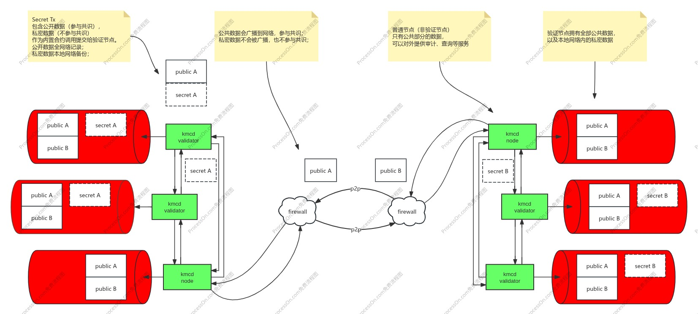

# KMCD v2.0

KMCD 是基于区块链的密钥管理中心（或数据库）。

## 需求

* 第一：链接银行与加密网络

随着稳定币及加密货币的发展，在可预见的未来，银行也将会不断的提供基于加密资产的金融服务。从银行角度看，将需要能够链接大量的加密网络。

* 第二：托管与安全审计能力

银行需要为客户管理加密资产，这就需要安全的管理大量的客户密钥，这要求既可以中心化的管理客户的托管账户，也能够以去中心化的方式提供审计等安全保障能力。

* 第三：跨境的数据安全

现代的银行都拥有大量的跨境机构，要求所有机构共享客户的私密数据，即使在银行内部也必定是不可能的。这不仅会违反机构所在地的数据安全等相关监管政策，也会给客户带来潜在风险。

## 因此对KMCD v2.0 提出如下图的基本设计原则：

1) 共识的基础数据单元交易，应包含公开数据（参与共识），及私密数据（不参与共识）。公开数据全网络记录，例如账户地址，可用于审计；私密数据本地网络备份以确保本地的数据安全和有效性；

2) 公共数据会广播到网络，参与共识；私密数据不会被广播，也不参与共识；

3) 验证节点拥有全部公共数据，私密数据只会在机构数据中心内网的多个验证节点间传输备份，而不需要将私密数据传输给其他非验证节点；

4) 普通节点（非验证节点），只能够通过网络获取公共部分的数据。因此普通节点可以对外提供审计、查询等服务；同时跨境网络通过普通节点链接，以保证客户的私密数据不会被传输或暴露到数据中心之外。

5) 支持同态加密与智能合约。通过同态加密实现密钥分片及分布式解密等系统级安全，通过智能合约可以定制多签等业务管理功能。

